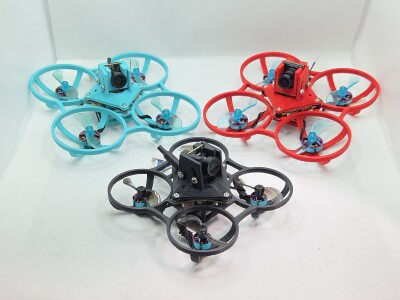
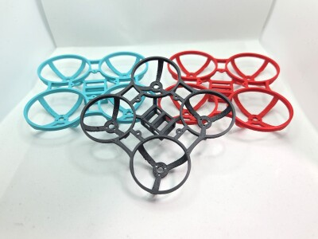
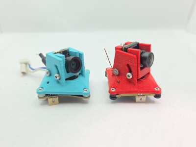
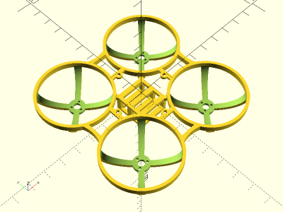
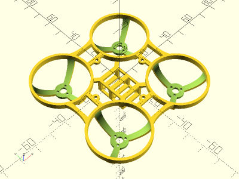
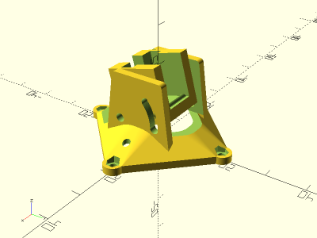
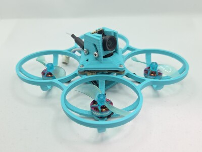
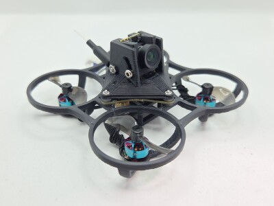
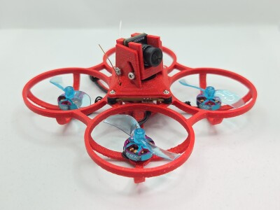

# Parametric Whoop

<table>
<tr>
<td></td>
<td></td>
</tr>
<tr>
<td></td>
<td></td>
</tr>
<tr>
<td></td>
<td></td>
</tr>
</table>

A parametric whoop frame and canopy. Canopy has an adjustable camera tilt of 0 to 40 degrees, secured with two M2 bolts. Canopy mounts to the frame with M1.4 bolts and captured nuts. Example builds for 75mm and 65mm analog and digital whoops provided. Made with OpenSCAD.

Strong impacts may break the motor struts, but they are easily fixed with CA and then stronger than before.

**Base Designs**

* [`whoop.scad`](whoop.scad) - Whoop Frame
* [`canopy.scad`](canopy.scad) - Whoop Canopy

**Instances**

* [`75mm_26x26_whoop.scad`](75mm_26x26_whoop.scad) - 75mm Whoop Frame with 26mm mounting holes (weight 8.0g ASA)
* [`65mm_26x26_whoop.scad`](65mm_26x26_whoop.scad) - 65mm Whoop Frame with 26mm mounting holes (weight 4.8g ASA)
* [`betafpv_c03_26x26_canopy.scad`](betafpv_c03_26x26_canopy.scad) - Canopy for BETAFPV C03 Camera with 26mm mounting holes (weight 1.7g ASA)
* [`betafpv_c03_camera_harness.scad`](betafpv_c03_camera_harness.scad) - BETAFPV C03 Camera Harness (weight 1.2g ASA)
* [`hdzero_lux_26x26_canopy.scad`](hdzero_lux_26x26_canopy.scad) - Canopy for HDZero Lux Camera with 26mm mounting holes (weight 1.8g ASA)
* [`hdzero_lux_camera_harness.scad`](hdzero_lux_camera_harness.scad) - HDZero Lux Camera Harness (weight 1.6g ASA)

**Recommended Print Settings:** ASA / PETG / Hard TPU, 0.20mm layer height, 100% infill, supports on build plate only for whoop frame, no supports for canopy or camera harness

**Recommended Support Settings (PrusaSlicer):** Avoid Crossing Perimeters: True, Style: Snug, Top contact Z distance: 0.20 (ASA), 0.23 (PETG), 0.25 (Hard TPU), Pattern Spacing: 3mm, Top interface layers: 4, XY separation between an object and its support: 100% (ASA, PETG), 250% (Hard TPU)

**Printables**: https://www.printables.com/model/1402069-parametric-whoop

**Thingiverse**: https://www.thingiverse.com/thing:7133627

## Builds

### 75mm BETAFPV Matrix 1S 5in1 (Analog VTX) + BETAFPV C03 Camera

* Frame: [75mm_26x26_whoop.stl](stl/75mm_26x26_whoop.stl)
* Canopy: [betafpv_c03_26x26_canopy.stl](stl/betafpv_c03_26x26_canopy.stl)
* Camera Harness: [betafpv_c03_camera_harness.stl](stl/betafpv_c03_camera_harness.stl)
* Flight Controller: [BETAFPV Matrix 1S](https://betafpv.com/collections/brushless-flight-controller/products/matrix-1s-brushless-flight-controller)
* Camera: [BETAFPV C03 Camera](https://betafpv.com/products/c03-fpv-micro-camera)
* Motors: RCinPower GTS V3 1002 19000KV
* Props: Gemfan 1610-2 40mm
* Hardware:
    * 12x M1.4x3 for motors (included with motors)
    * 4x M1.4 nuts and 4x M1.4x8 bolts for frame, flight controller, canopy
    * 2x M2 nuts and 2x M2x20 bolts for camera harness

Total Weight without battery: 31.8g ASA

### 65mm BETAFPV Matrix 1S 5in1 (Analog VTX) + BETAFPV C03 Camera

* Frame: [65mm_26x26_whoop.stl](stl/65mm_26x26_whoop.stl)
* Canopy: [betafpv_c03_26x26_canopy.stl](stl/betafpv_c03_26x26_canopy.stl)
* Camera Harness: [betafpv_c03_camera_harness.stl](stl/betafpv_c03_camera_harness.stl)
* Flight Controller: [BETAFPV Matrix 1S](https://betafpv.com/collections/brushless-flight-controller/products/matrix-1s-brushless-flight-controller)
* Camera: [BETAFPV C03 Camera](https://betafpv.com/products/c03-fpv-micro-camera)
* Motors: RCinPower 0702 27000KV
* Props: Gemfan 1210-2 31mm
* Hardware:
    * 12x M1.4x3 for motors (included with motors)
    * 4x M1.4 nuts and 4x M1.4x8 bolts for frame, flight controller, canopy
    * 2x M2 nuts and 2x M2x20 bolts for camera harness

Total Weight without battery: 24.4g ASA

### 75mm HDZero AIO5 (Digital VTX) + HDZero Lux Camera

* Frame: [`75mm_26x26_whoop.scad`](75mm_26x26_whoop.scad) with `battery_cage_y_length = 16;`
* Canopy: [hdzero_lux_26x26_canopy.stl](stl/hdzero_lux_26x26_canopy.stl)
* Camera Harness: [hdzero_lux_camera_harness.stl](stl/hdzero_lux_camera_harness.stl)
* Flight Controller: [HDZero AIO5](https://www.hd-zero.com/product-page/hdzero-aio5)
* Camera: [HDZero Lux Camera](https://www.hd-zero.com/product-page/hdzero-lux-camera)
* Motors: RCinPower GTS V3 1002 19000KV
* Props: Gemfan 1610-2 40mm
* Hardware:
    * 12x M1.4x3 for motors (included with motors)
    * 4x M1.4 nuts and 4x M1.4x8 bolts for frame, flight controller, canopy
    * 2x M2 nuts and 2x M2x20 bolts for camera harness

Total Weight without battery: 35.2g ASA

## License

